Case Study 3 – Foodie-Fi Subscription Analysis

📌 Dataset
This case study uses the Foodie-Fi subscription dataset with two tables:

- plans – Plan details (trial, monthly, annual, churn, etc.)
- subscriptions – Customer subscription events with plan_id and start_date

The goal is to analyze customer behavior, churn, upgrades, and plan trends.

✅ Results
All questions were successfully analyzed. Insights include churn behavior, trial conversion, upgrades, and downgrades.

🏆 Learnings & Skills
- Using window functions (LAG) to track previous plans
- Calculating percentages and averages from event tables
- Analyzing customer behavior over time
- Understanding subscription lifecycle (trial → paid → churn)

📈 Analysis Questions & Screenshots

Q1: Total Customers  
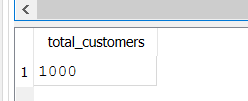  
Count of unique customers.

Q2: Monthly distribution of trial plan start_date  
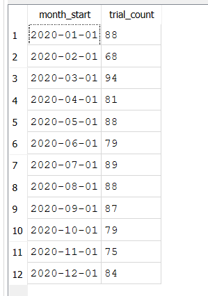  
Shows the number of trial subscriptions starting each month.

Q3: Plan start_date values after 2020, breakdown by plan_name  
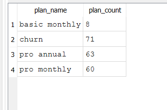  
Count of subscription events per plan for dates after 2020.

Q4: Customer count & percentage of churned customers  
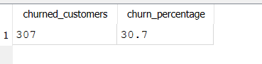  
How many customers churned and their percentage.

Q5: Customers who churned straight after initial trial  
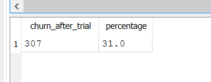  
Count and percentage of customers who left after trial.

Q6: Number and percentage of customer plans after initial trial  
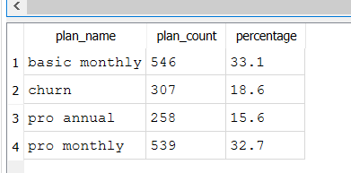  
Count and percentage breakdown of all plans after trial.

Q7: Customer count & percentage breakdown of all 5 plan_name values at 2020-12-31  
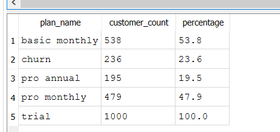  
Snapshot of plans held by customers at end of 2020.

Q8: Customers upgraded to annual plan in 2020  
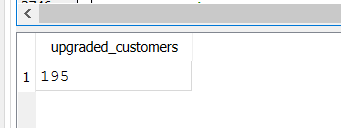  
Count of customers who upgraded to an annual plan in 2020.

Q9: Average days to upgrade to an annual plan from joining  
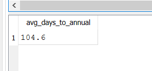  
Average number of days for a customer to move to an annual plan.

Q10: Breakdown of average days into 30-day periods  
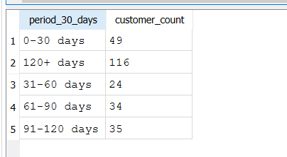  
Groups customers by how long it took to upgrade (0-30, 31-60, 61-90, 91+ days).

Q11: Customers downgraded from pro monthly to basic monthly in 2020  
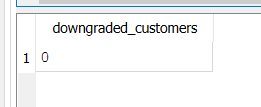  
