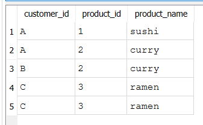

 Case Study 1 – Danny’s Diner

 📌 Dataset
This case study uses a small restaurant dataset with three tables:
- sales – Customer orders  
- menu – Product details and prices  
- members – Customer membership dates  
We analyze the data to answer real-world business questions.

 📈 Ranking & Window Functions
A key focus of this project is Ranking to analyze customer behavior:
- Identify top customers based on total spending  
- Rank orders by date for each customer  
- Compare members vs non-members  
- Track the first and last purchase per customer  

✅ Results

All 10 questions were solved successfully
Ranking and window functions were used to analyze customer order patterns
Insights include top spending customers, most popular menu items, and customer visit frequency

🏆 Learnings

Organizing SQL queries professionally
Applying Ranking and Window Functions in real datasets
Understanding table relationships and customer behavior
Building a clean, portfolio-ready SQL project

Results Screenshots
What is the total amount each customer spent at the restaurant?

How many days has each customer visited the restaurant?

What was the first item from the menu purchased by each customer?

What is the most purchased item on the menu and how many times was it purchased by all customers?

Which item was the most popular for each customer?

Which item was purchased first by the customer after they became a member?

Which item was purchased just before the customer became a member?

What is the total items and amount spent for each member before they became a member?

If each $1 spent equates to 10 points and sushi has a 2x points multiplier - how many points would each customer have?

In the first week after a customer joins the program (including their join date) they earn 2x points on all items, not just sushi - how many points do customer A and B have at the end of January?

GROUP BY customer_id
