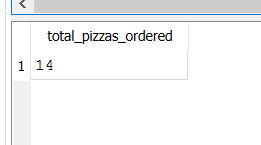
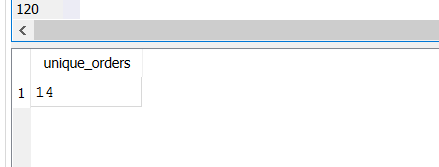
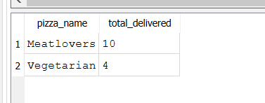
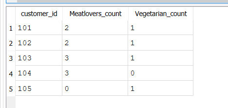
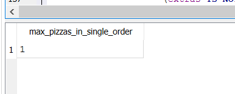
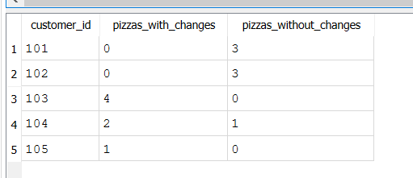
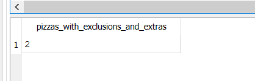
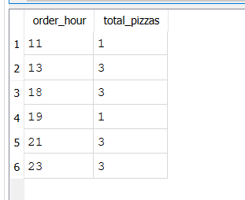
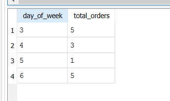

 Case Study 2 - Pizza Runner Analysis

This repository contains SQL queries and results for Case Study 2 of the 8 Week SQL Challenge.

We analyzed pizza orders and runner performance at Danny's Diner.

 Skills Practiced

- Window Functions (RANK, ROW_NUMBER)  
- Aggregation & Grouping (COUNT, SUM, AVG, GROUP BY)

 A. Orders and Pizzas Analysis

1. Total pizzas ordered  
   

2. Unique customer orders  
   

3. Successful orders per runner  
   

4. Number of each type of pizza delivered  
   

5. Vegetarian & Meatlovers per customer  
   

6. Maximum pizzas in a single order  
   

7. Delivered pizzas with/without changes  
   

8. Pizzas with both exclusions & extras  
   

9. Total pizzas per hour  
   

10. Orders per day of the week  
    

 
